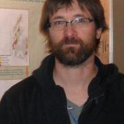

## ¿De qué se trata este curso?

Este curso en español fue desarrollado con las siguientes personas en mente:

* _René_ tiene 35 años y posee un título en ingeniería agronómica. Trabaja con datos espaciales y de sensores remotos desde hace 5 años.  Sus herramientas de trabajo incluyen QGIS, ENVI y gvSIG. Conoce los diferetnes catálogos de imágenes satelitales disponibles y como descargarlas.  También conoce que tipo de uso se le puede dar a cada imágen, como por ejemplo que tipo de indices pueden calcularse y para qué utilizar cada uno de ellos.  Como parte de su trabajo debe analizar imagenes a nivel de lote de productor pero también regionalmente. Ha escuchado hablar de geotecnologías en la nube pero no tiene experiencia utilizando estas herramientas.  Tampoco programa en ningún lenguaje de programación (aunque ha utilizado algunos códigos de Python dentro de QGIS y algo de visual basic script en Excel).

Este curso se dictó en el marco del [Congreso de Agroinformática 2019](http://48jaiio.sadio.org.ar/Anales/Cai/Presentacion).

## Objetivo 

Presentar a las y los asistentes la plataforma Google Earth Engine y como utilizarla con información espacial raster y vectorial.

## Contenido

1. ¿Qué es Google Earth Engine?

2. Plataforma GEE

  * 2.1. Editor de Código

3. Programando

  * 3.1. Conceptos Básicos

  * 3.2. Tipos de datos básicos de Java Scripts

  * 3.3. Funciones

  * 3.4. Objetos de GEE

4. Gestión de datos Vectoriales

  * 4.1. Creación de Geometrías

  * 4.2. Operaciones con Geometrías

  * 4.3. Features 

  * 4.4. Features Collections

  * 4.5. Operaciones con FeaturesCollection

5. Gestión de datos Raster

## Requisitos previos

Necesitamos que te registres en la herramienta para poder utilizarla durante el curso, para ello debes entrar en este link:

https://signup.earthengine.google.com/

## ¿Quienes somos? 

**Yanina Bellini Saibene**

Yanina Bellini Saibene, MSc. Lic. Es investigadora titular en el Instituto Nacional de Tecnología Agropecuaria (INTA, Argentina). Aplica sus conocimientos de informática y ciencia de datos para llevar los desarrollos tecnológicos a las regiones rurales de Argentina. Coordina la Red Nacional de Modelización de Agroecosistemas en el INTA. También desarrolla software para apoyar la investigación y la educación. Es profesora de grado y posgrado en varias universidades de Argentina y Uruguay, enseñando Ciencia de Datos aplicada y desarrollando cursos abiertos y tutoriales para enseñar habilidades técnicas en el manejo de datos. Es trainer e instructora de [The Carpentries](https://carpentries.org/) e instructora certificada de [RStudio](https://education.rstudio.com/trainers/people/bellini_saibene+yanina/). Tambiés es miembro del Executive Council de The Carpentries y Conferences Team Lead de [Forwards](https://forwards.github.io/). Es cofundadora y miembro del Core-Team de [MetaDocencia](http://metadocencia.org/). Forma parte del equipo de [R-Ladies Global](https://rladies.org/), preside varias conferencias internacionales (useR! 2021, LatinR, JAIIO) y es conferencista internacional. También lidera y participa en la traducción comunitaria de material educativo y técnico al español, como [Teaching Tech Together](https://teachtogether.tech/es/index.html), [R4DS](https://es.r4ds.hadley.nz/) y lecciones de The Carpentries. 

[yabellini.netlify.com](https://yabellini.netlify.com/)
[\@yabellini](https://twitter.com/yabellini)

**Hernán Javier Elena**

Es Licenciado en Informática por la Universidad Argentina de la Empresa (UADE). Curso sus estudios de postgrado en la Universidad de Girona (España) obteniendo el título de Máster UNIGIS en Gestión de Sistemas de Información Geográfica (2012).  Se desempeña desde 2004 como investigador de INTA en el Laboratorio de Teledetección y SIG (Grupo de Recursos Naturales) del INTA EEA Cerrillos.

Se especializa en: Gestión de bases de datos espaciales (Geodatabases en entorno multiusuario), SIG y Teledetección para el Ordenamiento Territorial (Agua, suelo, uso de la tierra), Software  SIG  libre – investigación e implementación, Red de información agroclimática, Servidores de datos espaciales con software libre – IDE y Webmaster.

[https://inta.gob.ar/personas/elena.hernan](https://inta.gob.ar/personas/elena.hernan)

## Licencia

 
Todo el material de este curso está bajo la licencia <a rel="license" href="https://creativecommons.org/licenses/by-sa/4.0/deed.es_ES">Creative Commons Attribution-ShareAlike 4.0 International License</a>.

El código fuente de estos materiales y la página web pueden encontrarse en https://github.com/yabellini/GEE_course_code.

### Cómo citar este trabajo

Puedes citar este recurso como:

> Yanina Bellini Saibene. (2022). yabellini/GEE_course_code: Google Earth Engine desde cero (v1.1). Zenodo. https://doi.org/10.5281/zenodo.5851443

